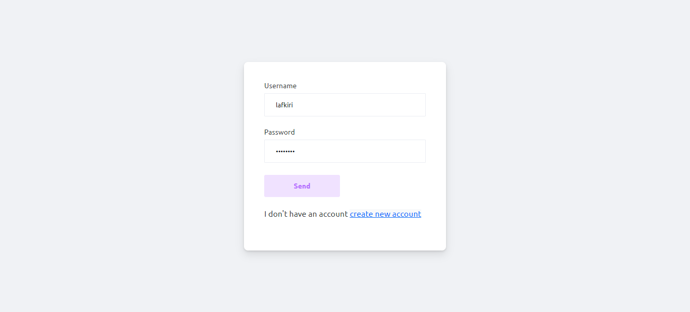
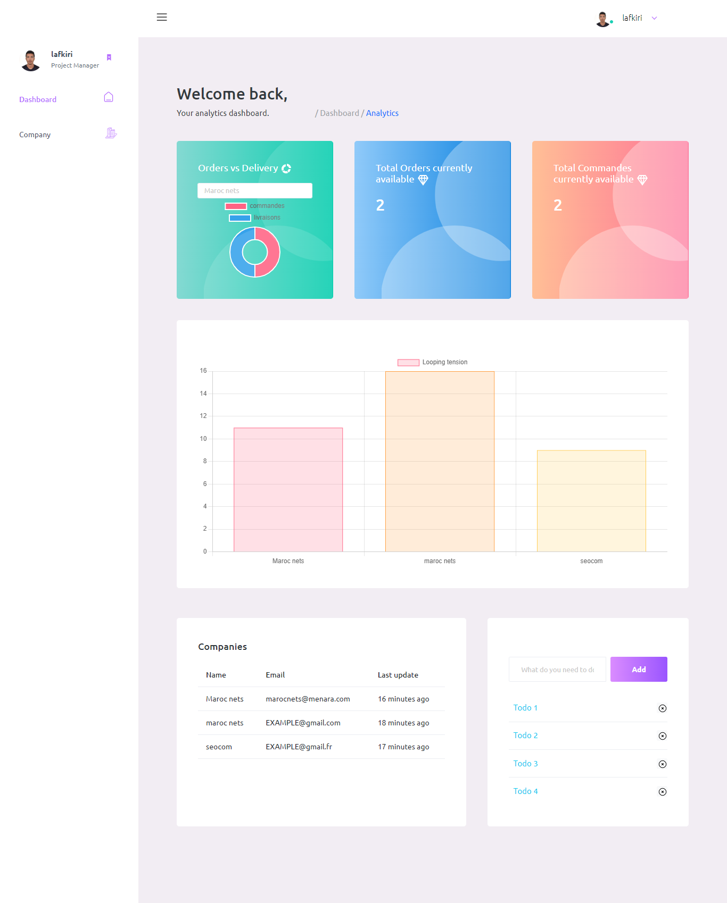
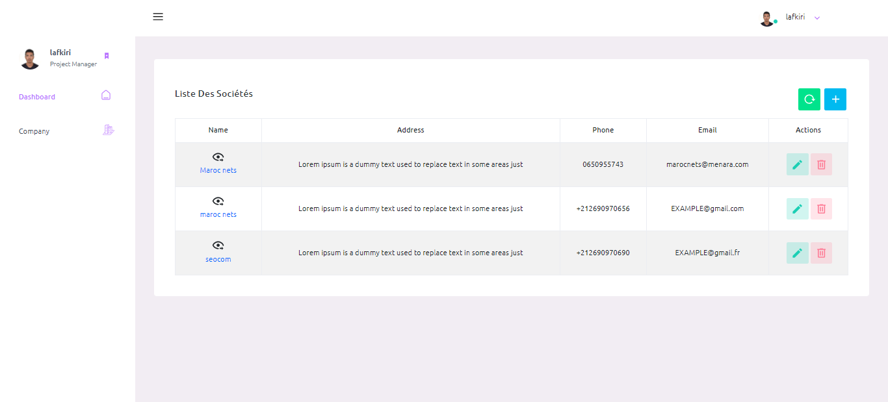
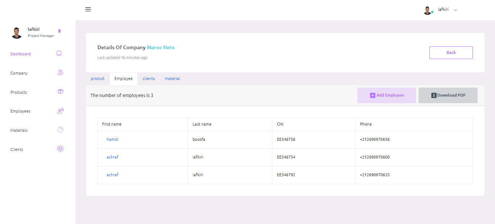
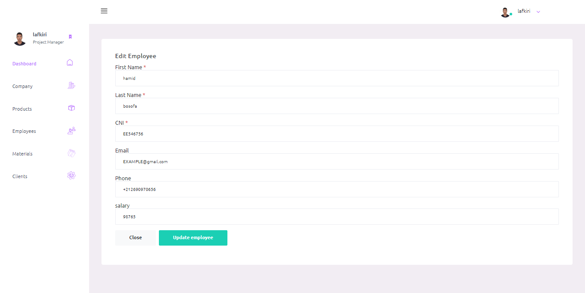
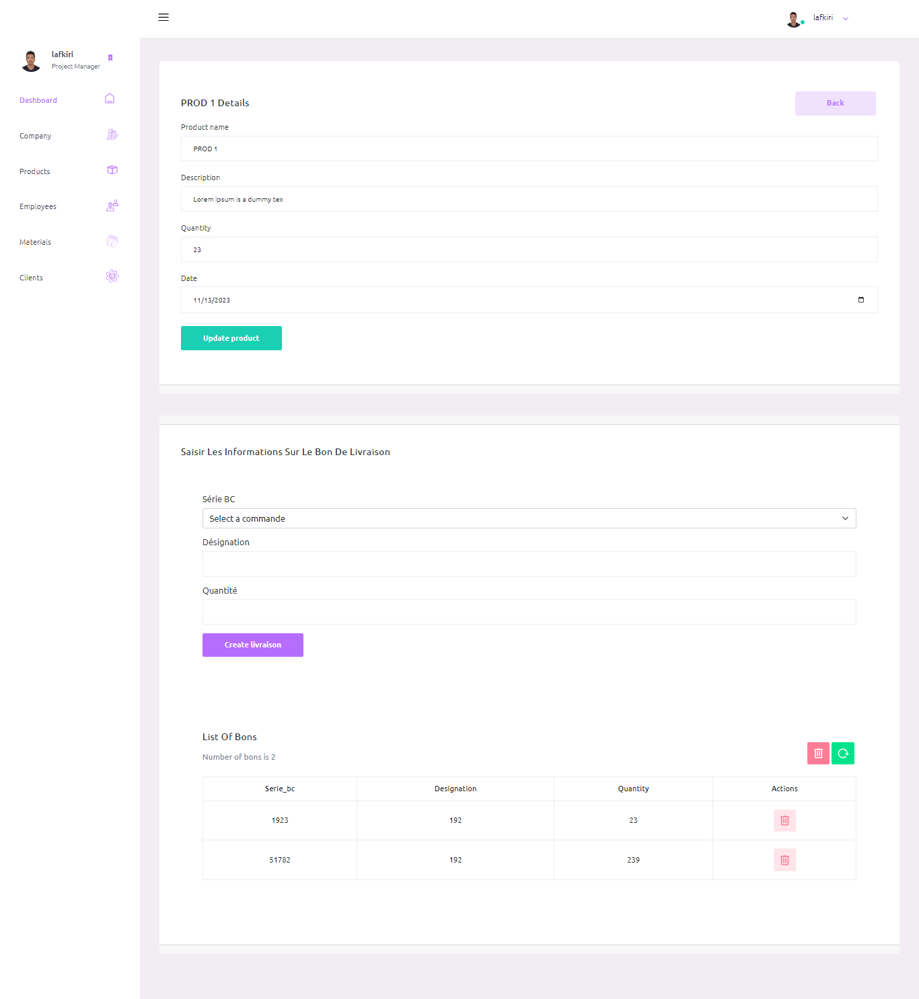

# Project Name: Career Pro - career management system

Welcome to Gestion de Carrier! This MERN stack application is a robust tool for managing company resources efficiently.

## Features

- CRUD operations for companies, clients, materials, employees, and products
- "Bon de Commande" management for product receipts
- Easy-to-use interface for admin users

## Technologies Used

- Frontend: React
- Backend: Node.js, Express.js
- Database: MongoDB

## Getting Started

1. Clone the repository
    git clone https://github.com/achraflafkiri/CareerPro-Advanced-Career-Management-System.git CareerPro
    cd CareerPro
2. Set up the backend:
    - Install backend dependencies with `npm install` in the `server` directory
    - Configure the `.env` file with necessary details
    - Start the backend server with `npm start`
3. Set up the frontend:
    - Install frontend dependencies with `npm install` in the `clients` directory
    - Modify API endpoints to connect to the backend
    - Start the frontend server with `npm start`

## Usage

- Access the app via a web browser
- Use the dashboard to manage various company resources

## Contributing

We welcome contributions! Feel free to fork the repository and submit a pull request with your enhancements or bug fixes.

## License

This project is licensed under the MIT License - see the [LICENSE.md](link-to-license.md) file for details.

## create .env file in ./sever folder :
DB=
JWT_SECRET=
JWT_EXPIRES_IN=
NODE_ENV=

## Qucik View

    

## Contact US

[My Portfolio](https://www.lafkiri.com)
